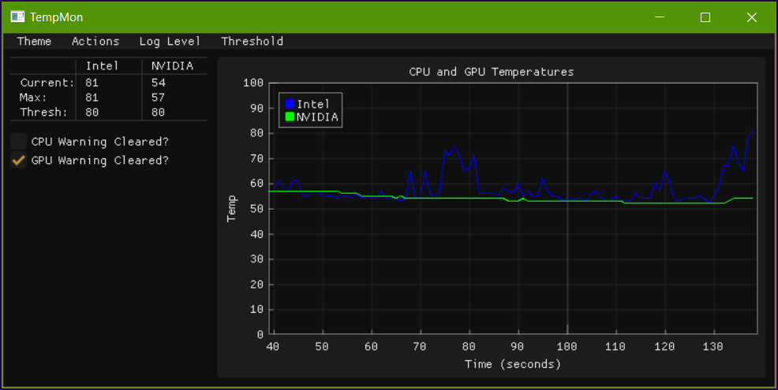

# tempmon
A simple CPU and GPU temperature monitor.

Windows seems to require Administrator rights in order to read CPU and GPU temperatures.



---

## Usage


From a terminal, enter the main tempmon directory and run:

```> python.exe tempmon.py```

If run as a regular user, the system will prompt for UAC permissions, and spawn a new terminal window with elevated rights. 

To run tempmon in the background, run:

```> pythonw.exe tempmon.py```

---

## TODO

-  [x] Add ability to save custom threshold.
-  [ ] Discord bot
-  [ ] CPU/GPU load option